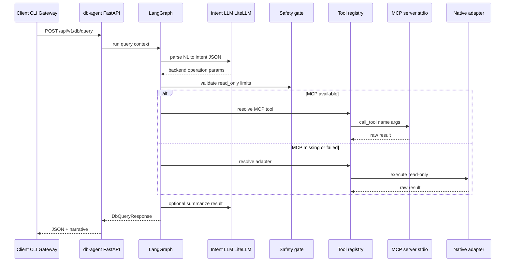

# db-agent — Design Specification

**Tool policy:** **Any cost OK.** Default **universal MCP gateway** (Google MCP Toolbox) for Postgres/Mongo/Redis. **Deployment is your choice:** `MCP_DEPLOYMENT_MODE=self_hosted` (run Toolbox on AM infra) or `managed` (Google Cloud remote MCP). Kafka, Qdrant, Grafana use **satellite MCPs**. Per-backend-only mode available via `universal_gateway: none`.

**Status:** Phase 2a implemented — see [`db-agent/`](../db-agent/).

---

## 1. Purpose

`db-agent` is a **natural-language interface to AM infrastructure data stores**. It:

1. Accepts a human or agent question (English).
2. Parses **intent** (which backend, which operation, parameters).
3. Executes via **MCP tools** (vendor OSS, Google Toolbox, managed GCP MCP, or other) when available, else a **read-only native adapter**.
4. Returns **structured JSON + a short narrative summary** (optional LLM).

It does **not** replace domain agents (`fin-agent`, `ui-test-agent`). It is for **ops, debugging, and cross-cutting infra queries**.

**Tool policy:** **Any cost OK.** Default **universal MCP gateway** (Google MCP Toolbox) for Postgres/Mongo/Redis. **Deployment is your choice:** `MCP_DEPLOYMENT_MODE=self_hosted` (run Toolbox on AM infra) or `managed` (Google Cloud remote MCP). Kafka, Qdrant, Grafana use **satellite MCPs**. Per-backend-only mode available via `universal_gateway: none`.

---

## 2. LiteLLM baseline (current preprod)

What exists today (verified against live cluster):

| Capability | Status |
|------------|--------|
| LLM models (DeepSeek, Gemini, Together Llama, Together Qwen VL) | **Live** — ConfigMap `litellm-config` |
| Langfuse tracing | **Live** — success/failure callbacks |
| LiteLLM Postgres metadata DB | **Live** — `postgresql.infra/litellm` |
| MCP servers registered | **Empty** — `GET /v1/mcp/server` → `[]` |
| `am_mcp_gateway` MCP in ConfigMap | **In repo template only** — not on live ConfigMap |

**Design implication:** db-agent ships its **own MCP client** (stdio/HTTP subprocess). Optionally **registers the same servers** into LiteLLM via Management API (reuse [`sync_litellm_mcp_tools.py`](../../am-platform/am-mcp-gateway/scripts/sync_litellm_mcp_tools.py) pattern) so Cursor/gateway can use the same tools.

---

## 3. Architecture

### 3.1 High-level



### 3.2 LangGraph nodes

| Node | Input | Output |
|------|-------|--------|
| `parse_intent` | `query`, optional `backend_hint` | `IntentDocument` |
| `validate_safety` | `IntentDocument`, settings | pass or `SafetyError` |
| `resolve_tool` | `IntentDocument` | `ToolCall` (mcp or adapter) |
| `execute_tool` | `ToolCall` | `ToolResult` (raw) |
| `format_response` | `ToolResult`, original query | `DbQueryResponse` |

No multi-step ReAct in **v1** unless intent confidence &lt; threshold → one clarify round max.

### 3.3 Integration modes

| Mode | When | How |
|------|------|-----|
| **Standalone API** | Default | Clients call `db-agent:8140` directly |
| **LiteLLM MCP hub** | Phase 2c | Register universal + satellite MCPs on LiteLLM |
| **Gateway proxy** | Phase 3 | `POST /api/v1/tools/db/query` on am-mcp-gateway |

### 3.4 MCP deployment modes (configurable)

| `MCP_DEPLOYMENT_MODE` | Universal layer | Satellites |
|-----------------------|-----------------|------------|
| **`self_hosted`** (default) | `./toolbox` or K8s sidecar HTTP | Confluent, Qdrant, Grafana MCP on AM cluster |
| **`managed`** | Google Cloud MCP remote URLs + OAuth | Same satellites; GCP where available |
| **`hybrid`** | Per-backend in `backends.{env}.yaml` | Mix self-hosted + managed |

Env vars:

```env
MCP_DEPLOYMENT_MODE=self_hosted   # self_hosted | managed | hybrid
MCP_UNIVERSAL_GATEWAY=toolbox     # toolbox | none
TOOLBOX_TOOLS_FILE=config/toolbox.yaml
TOOLBOX_URL=http://mcp-toolbox.infra.svc:5000   # when transport=http
GCP_MCP_ENDPOINTS_JSON={}         # managed mode: BigQuery, Cloud SQL URLs
```

---

## 4. HTTP API

### 4.1 `POST /api/v1/db/query`

**Request**

```json
{
  "query": "list all Qdrant collections and point counts",
  "backend": null,
  "environment": "preprod",
  "read_only": true,
  "include_summary": true,
  "max_rows": 100
}
```

| Field | Type | Description |
|-------|------|-------------|
| `query` | string | Natural language question (required) |
| `backend` | string? | Force backend; skip classifier if set |
| `environment` | string | `preprod` \| `local` — loads `backends.{env}.yaml` |
| `read_only` | bool | Default `true`; server may still deny if env disallows writes |
| `include_summary` | bool | Run summary LLM on result |
| `max_rows` | int | Cap for tabular results |

**Response**

```json
{
  "request_id": "uuid",
  "backend": "qdrant",
  "operation": "list_collections",
  "read_only": true,
  "confidence": 0.94,
  "tool_source": "mcp",
  "tool_name": "qdrant_list_collections",
  "data": { "collections": [] },
  "summary": "Found 4 collections: ui_patterns, ...",
  "warnings": [],
  "duration_ms": 420
}
```

**Errors:** `400` invalid intent · `403` safety block · `502` backend/MCP failure · `504` timeout

### 4.2 `GET /health` · `GET /ready`

- `ready` checks: LiteLLM reachable, at least one backend config loaded, MCP binaries on PATH (optional soft check)

---

## 5. Intent model

### 5.1 `IntentDocument`

```python
class IntentDocument(BaseModel):
    backend: Literal["postgres", "mongodb", "redis", "kafka", "qdrant", "influx", "grafana"]
    operation: str  # registry key, e.g. "list_collections"
    params: dict[str, Any] = {}
    read_only: bool = True
    confidence: float
    rationale: str
```

### 5.2 Operation catalog (v1)

| Backend | Operations | MCP tool mapping (preferred) |
|---------|------------|------------------------------|
| **postgres** | `search_schema`, `run_sql`, `table_row_count` | DBHub `search_objects`, `execute_sql` |
| **mongodb** | `list_databases`, `list_collections`, `find`, `aggregate`, `collection_schema` | Mongo MCP `list-databases`, `find`, `aggregate`, … |
| **redis** | `scan_keys`, `get`, `info`, `type` | mcp-redis equivalents |
| **qdrant** | `list_collections`, `collection_info`, `scroll`, `search` | mcp-server-qdrant + native scroll for admin |
| **kafka** | `list_topics`, `describe_topic`, `peek_messages`, `consumer_lag` | Confluent MCP tools |
| **grafana** | `search_dashboards`, `get_dashboard`, `query_datasource` | mcp-grafana tools |
| **influx** | `query_flux`, `query_influxql` | mcp-grafana `query_influxdb` OR native adapter |

Intent LLM receives **operation catalog snippet** in system prompt (not full MCP schema — keeps tokens low). `resolve_tool` maps operation → concrete MCP tool + args builder.

---

## 6. Tool registry

### 6.1 Registry entry

```yaml
# config/registry.yaml
backends:
  qdrant:
    mcp_server: qdrant
    adapter: adapters.qdrant.QdrantAdapter
    operations:
      list_collections:
        mcp_tool: list_collections  # or vendor-specific name
        adapter_method: list_collections
        read_only: true
```

### 6.2 MCP server processes

**Universal gateway (default):** one Google MCP Toolbox process serves Postgres, Mongo, Redis via `config/toolbox.yaml`.

**Satellites:** separate MCP processes for backends Toolbox does not cover.

| Layer | Alias | Command | Backends |
|-------|-------|---------|----------|
| **Universal** | `toolbox` | `./toolbox --tools-file config/toolbox.yaml` | postgres, mongodb, redis |
| **Satellite** | `kafka` | `npx @confluentinc/mcp-confluent` | kafka |
| **Satellite** | `qdrant` | `uvx mcp-server-qdrant --url $QDRANT_URL` | qdrant |
| **Satellite** | `grafana` | `mcp-grafana --enabled-tools influxdb,...` | grafana, influx |

**Managed mode:** replace `toolbox` stdio with HTTP URLs from `GCP_MCP_ENDPOINTS_JSON` (Cloud SQL MCP, BigQuery MCP, etc.) — same registry, different transport config.

**Per-backend-only:** set `MCP_UNIVERSAL_GATEWAY=none` and use DBHub / Mongo MCP / mcp-redis as individual servers (legacy layout).

**K8s:** prefer HTTP sidecar for Toolbox + satellites over stdio in the main pod (`transport: stdio|http` in `mcp/servers.yaml`).

### 6.3 Native adapter fallback

Used when:

- MCP subprocess fails to start
- Operation not exposed by MCP (e.g. Qdrant collection admin metrics)
- Influx direct Flux without Grafana datasource

Adapters implement:

```python
class BaseAdapter(Protocol):
    async def execute(self, operation: str, params: dict, *, read_only: bool) -> Any: ...
```

Reuse code from:

- [`am-ui-test-agent/app/memory/qdrant.py`](../../am-ui-test-agent/app/memory/qdrant.py)
- [`am-fin-agent`](../../am-fin-agent/) Mongo patterns

---

## 7. Configuration

### 7.1 Environment variables

```env
# App
APP_PORT=8140
APP_ENV=preprod
LOG_LEVEL=INFO

# LLM (intent + summary) — Together via LiteLLM
LLM_ROUTING=direct
LITELLM_BASE_URL=http://localhost:4000
LITELLM_MASTER_KEY=sk-...
LLM_PLANNER_MODEL=together_ai/meta-llama/Meta-Llama-3-8B-Instruct-Lite

# Safety
DB_AGENT_READ_ONLY_DEFAULT=true
DB_AGENT_ALLOW_WRITES=false
DB_AGENT_MAX_ROWS=100
DB_AGENT_TIMEOUT_SECONDS=30

# MCP deployment (user choice)
MCP_DEPLOYMENT_MODE=self_hosted
MCP_UNIVERSAL_GATEWAY=toolbox
TOOLBOX_TOOLS_FILE=config/toolbox.yaml

# Backends (from Vault in prod — examples only)
POSTGRES_URL=postgresql://...
MONGODB_URI=mongodb://...
REDIS_URL=redis://...
QDRANT_URL=https://qdrant.munish.org:443
QDRANT_API_KEY=
KAFKA_BOOTSTRAP_SERVERS=kafka.infra.svc.cluster.local:9092
GRAFANA_URL=https://am.munish.org/grafana
GRAFANA_API_KEY=
INFLUX_URL=http://influxdb.infra.svc.cluster.local:8086
INFLUX_TOKEN=
```

### 7.2 `config/backends.preprod.yaml`

Non-secret connection targets only (hosts, ports, TLS). Matches [`am-infra`](../../am-infra/README.md) service map.

---

## 8. Safety

Four enforcement layers (defense in depth):

| Layer | Where | What |
|-------|-------|------|
| 1 | `config/registry.yaml` | Whitelist backend + operation pairs |
| 2 | `validate_safety` node | `validate_intent()` — SQL/Mongo/Redis/Qdrant/Kafka write patterns |
| 3 | MCP config | Toolbox `--readonly`; satellite servers use read-only tool sets |
| 4 | `execute_tool` node | `validate_tool_call()` — re-scan params immediately before MCP/adapter |

| Rule | Enforcement |
|------|-------------|
| Default read-only | `DB_AGENT_READ_ONLY_DEFAULT=true` |
| SQL writes | Block `INSERT/UPDATE/DELETE/DROP/COPY/MERGE/...` unless `ALLOW_WRITES` |
| Mongo | Block `$out`, `$merge`, `deleteMany`, `insertOne`, etc. in params |
| Redis | Deny `FLUSH*`, `CONFIG`, `DEBUG`, `DEL`, `SET`, … |
| Kafka | No produce/publish in v1 |
| Qdrant | No upsert/delete/create_collection in v1 |
| Row/key limit | Truncate + `warnings[]` in response |
| Timeout | Per-tool asyncio timeout |
| Audit | Langfuse spans + structured logs (secrets redacted) |

---

## 9. LLM usage

| Step | Model | When |
|------|-------|------|
| Intent parsing | Together Llama via LiteLLM | Every query |
| Result summary | Same model | If `include_summary=true` |
| Tool execution | **No LLM** | MCP/adapter only |

Langfuse tracing (hybrid architecture):

| Span | Source | Content |
|------|--------|---------|
| `db-agent-query` (trace) | `runner.py` | NL query in, response summary out |
| `parse_intent` | graph node | backend, operation, confidence, parse_source |
| `validate_safety` | graph node | pass/block reason |
| `execute_tool` | graph node | tool params (sanitized), MCP vs adapter |
| `format_response` | graph node | summary present, duration |
| LLM generations | LiteLLM callback | `trace_id=request_id`, `generation_name=db-agent-intent\|summary` |

Config: `LANGFUSE_ENABLED`, `LANGFUSE_HOST`, `LANGFUSE_PUBLIC_KEY`, `LANGFUSE_SECRET_KEY`. Payloads pass through `app/observability/sanitize.py` (credential redaction + truncation).

---

## 10. LiteLLM MCP registration (Phase 2c)

Extend [`litellm_mcp_sync.py`](../../am-platform/am-mcp-gateway/app/tools/litellm_mcp_sync.py) or add `db-agent/scripts/sync_litellm_db_mcp.py`:

```python
# Register each backend MCP as separate LiteLLM server alias
aliases = ["db_postgres", "db_mongodb", "db_redis", "db_qdrant", "db_kafka", "db_grafana"]
# POST /v1/mcp/server for each
```

Also add to `litellm_config.yaml.tpl` for GitOps parity (optional — Management API is enough if ConfigMap lacks `mcp_servers` today).

---

## 11. Package layout (implementation target)

```text
am-agents/db-agent/
  app/
    main.py                 # FastAPI routes
    graph.py                # LangGraph workflow
    nodes/
      parse_intent.py
      validate_safety.py
      execute_tool.py
      format_response.py
    intent_schema.py
    safety.py
    registry.py
    config.py
  adapters/
    base.py
    postgres.py
    mongo.py
    redis.py
    kafka.py
    qdrant.py
    influx.py
    grafana.py
  mcp/
    client.py               # MCP JSON-RPC client (stdio + http)
    servers.yaml
    pool.py                 # subprocess lifecycle
  config/
    registry.yaml           # operation → tool mapping
    backends.preprod.yaml
    backends.local.yaml
  scripts/
    sync_litellm_db_mcp.py
  tests/
    test_intent_schema.py
    test_safety.py
    test_registry.py
    test_api_mock.py
  requirements.txt
  package.json              # npm scripts: dev, test
  .env.example
  README.md
```

**Shared code (Phase 2b):** extract LiteLLM client to `am-agents/libs/agent-common/` (copy from ui-test-agent `litellm_client.py`).

---

## 12. Implementation order

| Step | Deliverable |
|------|-------------|
| 1 | FastAPI skeleton + health + deployment mode config |
| 2 | Intent parser + Pydantic schema + tests (mock LLM) |
| 3 | Registry + safety gate (universal vs satellite routing) |
| 4 | MCP client + **Google MCP Toolbox** + Qdrant satellite |
| 5 | Redis/Mongo/Postgres via Toolbox `tools.yaml` |
| 6 | Grafana satellite (+ Influx via datasource) |
| 7 | Kafka satellite + **managed** mode config path |
| 8 | Summary LLM + Langfuse metadata |
| 9 | LiteLLM MCP sync (toolbox + satellites) |
| 10 | Gateway proxy route (optional) |

---

## 13. Example queries (acceptance)

| Query | Expected backend | Operation |
|-------|------------------|-----------|
| "How many points in ui_patterns?" | qdrant | `collection_info` |
| "Redis keys matching session:*" | redis | `scan_keys` |
| "Count rows in portfolio.holdings" | postgres | `run_sql` |
| "List Mongo databases" | mongodb | `list_databases` |
| "Kafka topics in infra cluster" | kafka | `list_topics` |
| "Show dashboards about market data" | grafana | `search_dashboards` |
| "Influx CPU last hour for am-market-data" | grafana or influx | `query_datasource` / `query_flux` |

---

## 14. Related documents

- [UNIVERSAL_DB_AGENTS_PLAN.md](UNIVERSAL_DB_AGENTS_PLAN.md) — MCP catalog + phases
- [MONOREPO_PLAN.md](MONOREPO_PLAN.md) — monorepo scaffold first
- [am-platform/docs/AM_MCP_GATEWAY_DESIGN.md](../../am-platform/docs/AM_MCP_GATEWAY_DESIGN.md)
