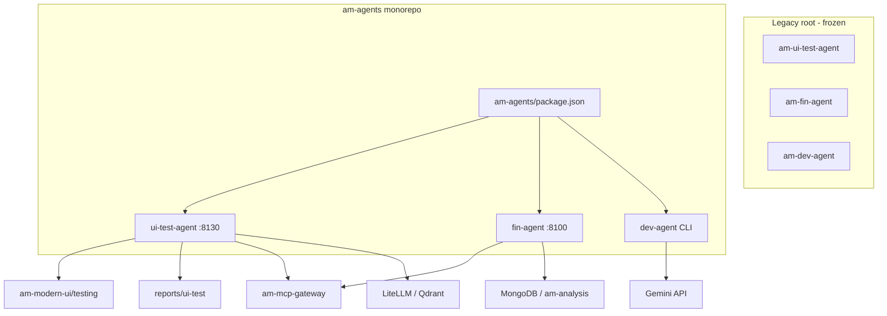

# AM Agents Monorepo Plan

**Status: deferred** — implement when ready. Say *"execute the am-agents plan"* in Cursor to run this checklist.

## Decisions locked in

| Decision | Choice |
|----------|--------|
| Layout | New `am-agents/` folder with three packages inside |
| Legacy folders | Keep `am-ui-test-agent`, `am-fin-agent`, `am-dev-agent` at repo root (frozen) |
| Copy strategy | **Full copy** — no destructive move, no deletion |
| Orchestration | npm workspaces (same pattern as `am-platform/`) |
| K8s / Helm | No changes in first pass — cluster still uses old service names |

## Goal

Introduce a new orchestrated monorepo at `am-agents/` containing all three AI agents, following the same pattern as [`am-platform/package.json`](../../am-platform/package.json). **Do not delete or modify** the existing root folders:

- [`am-ui-test-agent/`](../../am-ui-test-agent/) (legacy)
- [`am-fin-agent/`](../../am-fin-agent/) (legacy, nested `.git` stays as-is)
- [`am-dev-agent/`](../../am-dev-agent/) (legacy)

New development target: `am-agents/`.

## Target layout

```text
AM-Portfolio-grp/
├── am-ui-test-agent/          # LEGACY — add README pointer only
├── am-fin-agent/              # LEGACY — add README pointer only
├── am-dev-agent/              # LEGACY — add README pointer only
└── am-agents/                 # NEW monorepo root
    ├── package.json           # npm workspaces orchestrator
    ├── README.md              # index + quick start for all agents
    ├── docs/
    │   ├── MONOREPO_PLAN.md   # Phase 1 — this file
    │   └── UNIVERSAL_DB_AGENTS_PLAN.md  # Phase 2 — NL → DB backends (MCP-first)
    ├── .gitignore             # shared Python/node ignores
    ├── ui-test-agent/         # full copy from am-ui-test-agent
    ├── fin-agent/             # full copy from am-fin-agent (no nested .git)
    ├── dev-agent/             # full copy from am-dev-agent
    └── db-agent/              # Phase 2 — universal DB query agent (planned)
```



## Agent summary (unchanged behavior)

| Package | Port / entry | Stack | Primary deps |
|---------|--------------|-------|--------------|
| `ui-test-agent` | HTTP `:8130`, `npm run preprod` | FastAPI + LangGraph + Playwright | LiteLLM, Qdrant, `am-modern-ui` |
| `fin-agent` | HTTP `:8100`, `uvicorn api:app` | FastAPI + LangGraph ReAct | Together/Gemini, MongoDB, am-analysis |
| `dev-agent` | CLI `am-dev`, `pip install -e .` | Gemini coding agent | `pyproject.toml` |

## When you start (copy-paste commands)

From repo root `AM-Portfolio-grp/` (PowerShell):

```powershell
# 1. Scaffold
New-Item -ItemType Directory -Force am-agents/ui-test-agent, am-agents/fin-agent, am-agents/dev-agent

# 2. Copy (exclude caches/secrets)
robocopy am-ui-test-agent am-agents\ui-test-agent /E /XD .git .pytest_cache __pycache__ /XF .env
robocopy am-fin-agent am-agents\fin-agent /E /XD .git .pytest_cache __pycache__ /XF .env
robocopy am-dev-agent am-agents\dev-agent /E /XD .git .pytest_cache __pycache__ logs am_dev.egg-info /XF .env

# 3. After copy: add am-agents/package.json, README, path fixes (Step 2–4 below)
# 4. Verify: cd am-agents && npm run test
```

Estimated effort: **2–4 hours** (copy + path fixes + smoke tests).

## Step 1 — Copy agents (full copy, strip nested git)

Copy each tree into `am-agents/` excluding caches and secrets:

- **Exclude:** `.git/`, `.pytest_cache/`, `__pycache__/`, `.env`, `am_dev.egg-info/`, `logs/` (dev-agent runtime logs)
- **Include:** source, tests, helm (ui-test), `.env.example`, `.env.preprod` template values (ui-test), docs

`fin-agent` copy must **not** include its nested `.git` directory.

## Step 2 — Fix relative paths in the new copies

Root depth increases by one (`am-agents/<agent>/` vs `<agent>/`). Update paths in the **new copies only**:

**ui-test-agent**

| Setting / script | Old | New |
|------------------|-----|-----|
| `REPORT_DIR` in `.env.preprod` | `../reports/ui-test` | `../../reports/ui-test` |
| npm scripts / CLI defaults | `../am-modern-ui/...` | `../../am-modern-ui/...` |
| docs links in `docs/README.md` | `../am-platform/...` | `../../am-platform/...` |

Files to touch: `package.json`, `scripts/run_integrated_auth_test.py`, `scripts/run_auth_test.py`, `.env.preprod`, `.env.example`, `docs/README.md`, `helm/values.yaml` if any relative paths exist.

**fin-agent** — mostly self-contained; verify `api.py` `.env` load path still works (dirname-relative, no change expected).

**dev-agent** — no cross-repo path refs; copy `pyproject.toml` as-is.

## Step 3 — Create `am-agents/package.json` (npm workspaces)

Mirror `am-platform/package.json` style:

```json
{
  "name": "am-agents",
  "private": true,
  "workspaces": ["ui-test-agent", "fin-agent", "dev-agent"],
  "scripts": {
    "ui-test:dev": "npm run preprod -w @am/ui-test-agent",
    "ui-test:test": "npm run test -w @am/ui-test-agent",
    "ui-test:e2e:preprod": "npm run test:e2e:preprod -w @am/ui-test-agent",
    "fin:dev": "python fin-agent/api.py",
    "fin:test": "python -m pytest fin-agent/tests -q",
    "dev:install": "pip install -e dev-agent",
    "dev:run": "am-dev --help",
    "test": "npm run ui-test:test && npm run fin:test"
  }
}
```

Add minimal `package.json` to **fin-agent** and **dev-agent** workspaces (name `@am/fin-agent`, `@am/dev-agent`) so npm workspaces resolve.

## Step 4 — Root README and legacy pointers

**New `am-agents/README.md`:** quick start for all agents; link to [`am-platform/docs/ui-agent-ai-testing/`](../../am-platform/docs/ui-agent-ai-testing/).

**Legacy folders** — add short `README.md` in each:

```markdown
# Moved to am-agents

This folder is frozen legacy. Use `am-agents/ui-test-agent` (or fin-agent / dev-agent) instead.
```

No code changes inside legacy trees beyond this pointer file.

## Step 5 — Shared `.gitignore` at `am-agents/`

Aggregate common ignores: `.env`, `__pycache__/`, `.pytest_cache/`, `*.egg-info/`, `logs/`, `.venv/`.

## Step 6 — Verification (post-implementation)

From `am-agents/`:

1. `npm run ui-test:test` — pytest for ui-test-agent copy
2. `npm run fin:test` — pytest for fin-agent copy
3. `pip install -e dev-agent && python -m pytest dev-agent/tests -q`
4. Smoke: `npm run ui-test:e2e:preprod` (requires LiteLLM port-forward + Qdrant — optional if infra down)

## Out of scope (follow-up)

- Do not change `am-platform/am-mcp-gateway/helm/values.yaml` K8s service names in first pass
- Do not delete legacy root agent folders
- Do not unify Python deps into one venv yet
- Optional later: `am-agents/libs/agent-common` for shared LiteLLM client code

## Risk notes

- **Duplication:** two copies until legacy is archived manually
- **Drift:** legacy root folders are not maintained after cutover
- **fin-agent secrets:** copy `.env.example` only; user copies `.env` locally

## Later phases

1. **Deploy migration** — Helm/CI at `am-agents/ui-test-agent/helm`
2. **Docs sweep** — update platform docs paths
3. **Archive legacy** — remove root agent folders after team confirms
4. **Shared libs** — optional `agent-common` module
5. **Universal DB agents (Phase 2)** — [`UNIVERSAL_DB_AGENTS_PLAN.md`](UNIVERSAL_DB_AGENTS_PLAN.md): universal MCP Toolbox (self-hosted default) + satellite MCPs; optional managed GCP mode; any cost OK

## Resume checklist

- [ ] `am-agents/package.json` + workspace `package.json` files exist
- [ ] All `../` paths in ui-test copy updated to `../../`
- [ ] Legacy pointer READMEs added (3 files, no other legacy edits)
- [ ] `npm run test` from `am-agents/` passes
- [ ] Optional E2E: `npm run ui-test:e2e:preprod` with LiteLLM port-forward
