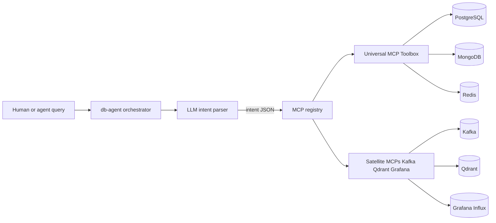
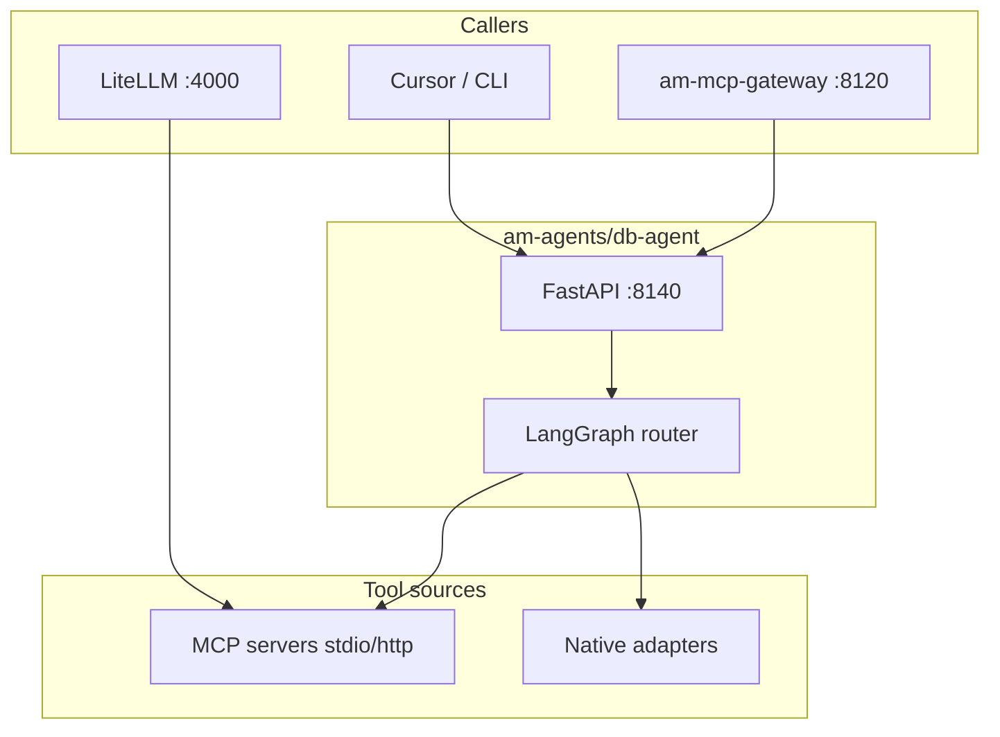

# Universal DB Agents Plan

**Status: Phase 2a implemented** — code in [`../db-agent/`](../db-agent/). Full design in **[DB_AGENT_DESIGN.md](DB_AGENT_DESIGN.md)**.

Parse natural-language questions into **safe, backend-specific operations** across AM infra databases and observability systems. Prefer **MCP servers** (official vendor, community, or managed) when they fit; fall back to thin Python adapters when MCP is missing or cannot reach cluster network.

**Tool selection:** **Cost is not a constraint** — OSS, paid, or managed services are all fine. **Default architecture: one universal MCP gateway** ([Google MCP Toolbox](https://github.com/googleapis/mcp-toolbox)) for Postgres, Mongo, Redis, and related SQL/NoSQL. **You choose how it runs:** self-hosted on AM infra (default for preprod) or Google Cloud managed MCP endpoints. Backends the universal layer does not cover (Kafka, Qdrant, Grafana/Influx) use **satellite MCP servers** or native adapters.

## Problem

Operators and agents ask questions like:

- "Show last 10 failed auth tests in Mongo"
- "What topics lag on Kafka consumer group X?"
- "List Qdrant collections and point counts"
- "Redis keys matching `session:*`"
- "Postgres row count for portfolio holdings"
- "Grafana dashboard for market-data errors"
- "Influx query: CPU last 1h for pod Y"

Today each system has different clients, URLs, and auth (see [`am-infra/traefik/infra.yaml`](../../am-infra/traefik/infra.yaml), Vault paths in [`VPS/vault/blueprints/v3_master.json`](../../VPS/vault/blueprints/v3_master.json)). A **universal DB agent** routes intent → the right backend through a **single configurable MCP layer**.

## Deployment strategy (configurable)

| Setting | Values | Meaning |
|---------|--------|---------|
| `MCP_DEPLOYMENT_MODE` | `self_hosted` (default) \| `managed` \| `hybrid` | Where MCP processes run |
| `MCP_UNIVERSAL_GATEWAY` | `toolbox` (default) | Universal multi-DB gateway product |

| Mode | Universal layer | Satellite MCPs | Typical cost |
|------|-----------------|----------------|--------------|
| **`self_hosted`** | Google MCP Toolbox binary/container on AM K8s or local | Confluent Kafka, Qdrant, Grafana MCP on same cluster | Infra + DB usage only; Toolbox is free OSS |
| **`managed`** | Google Cloud MCP remote servers (BigQuery, Cloud SQL, …) | Same satellites where GCP has no managed MCP | GCP service billing |
| **`hybrid`** | Self-hosted Toolbox for SQL/NoSQL + managed GCP for cloud-only data | Kafka, Qdrant, Grafana self-hosted | Mix — pick per backend in `config/backends.{env}.yaml` |

**Rule:** Universal gateway handles Postgres, Mongo, Redis (and BigQuery if used). **Satellites** stay for Kafka, Qdrant, Grafana/Influx unless/until Toolbox or managed MCP covers them. Native Python adapters remain last-resort fallback.

```yaml
# config/backends.preprod.yaml (sketch)
deployment:
  mode: self_hosted          # self_hosted | managed | hybrid
  universal_gateway: toolbox # toolbox | none (per-backend only)
universal:
  toolbox:
    tools_file: config/toolbox.yaml
    transport: http          # http sidecar in K8s, or stdio local
    url: http://mcp-toolbox.infra.svc:5000
satellites:
  kafka: { enabled: true, server: confluent }
  qdrant: { enabled: true, server: qdrant-mcp }
  grafana: { enabled: true, server: mcp-grafana }
```

## Architecture



### Layers

| Layer | Role |
|-------|------|
| **Orchestrator** | Accept NL query + optional `backend` hint; return structured answer + raw tool output |
| **Intent parser** | LLM (Together/Llama via LiteLLM) → JSON: `{backend, operation, params, read_only}` |
| **MCP registry** | Map backend → MCP server config or native adapter |
| **Safety gate** | Block writes/deletes unless `ALLOW_DB_WRITES=true`; SQL/aggregation limits; timeout caps |
| **Response formatter** | Human summary + machine JSON for downstream agents |

### Intent JSON (contract)

```json
{
  "backend": "mongodb|postgres|redis|kafka|qdrant|influx|grafana",
  "operation": "list_collections|run_query|describe|search|...",
  "params": {},
  "read_only": true,
  "confidence": 0.92,
  "rationale": "User asked for Mongo collection list"
}
```

## Backend matrix — universal gateway + satellites

| Backend | AM infra (preprod) | Via universal Toolbox | Satellite / other MCP | Fallback adapter |
|---------|-------------------|----------------------|----------------------|------------------|
| **PostgreSQL** | `postgresql.infra`, portfolio DBs | **Yes** — Toolbox `tools.yaml` | DBHub if `universal_gateway: none` | `asyncpg` read-only |
| **MongoDB** | `mongodb.infra`, market/portfolio DBs | **Yes** | Mongo MCP if no Toolbox | `motor` (fin-agent patterns) |
| **Redis** | `redis.infra:6379` | **Yes** | mcp-redis if no Toolbox | `redis-py` allowlist |
| **Kafka** | `kafka.infra:9092` | No | **Confluent MCP** (satellite) | `aiokafka` peek |
| **Qdrant** | `qdrant.munish.org` / cluster svc | Limited | **mcp-server-qdrant** (satellite) | ui-test Qdrant client |
| **Grafana** | `/grafana` via Traefik | No | **mcp-grafana** (satellite) | Grafana HTTP API |
| **InfluxDB** | `influxdb.infra:8086` | Partial | **Grafana MCP** `query_influxdb` | `influxdb-client` Flux |

**Rule:** If an MCP server is listed in LiteLLM [`mcp_servers`](../../am-platform/automation/terraform/modules/ai-gateway/litellm_config.yaml.tpl) or runs as sidecar, use it. Do not duplicate tool logic in Python unless MCP is missing or cannot reach cluster network.

## Integration with existing AM stack



- **LiteLLM:** Register DB MCP servers in cluster ConfigMap (same pattern as `am_mcp_gateway` today).
- **am-mcp-gateway:** Optional proxy route `POST /api/v1/db/query` → db-agent (Phase 3).
- **Vault:** Connection strings from existing paths (`apps/preprod/infra/*`) — never commit secrets.
- **Reuse:** Qdrant embedder/query from ui-test-agent; Mongo tools from fin-agent where overlap exists.

## Proposed folder layout (inside `am-agents/`)

```text
am-agents/
  db-agent/
    app/
      main.py              # FastAPI :8140
      orchestrator.py      # LangGraph: parse → route → format
      intent_schema.py     # Pydantic intent models
      safety.py            # read-only gate, timeouts, allowlists
      registry.py          # backend → MCP | adapter
    adapters/
      postgres.py
      mongo.py
      redis.py
      kafka.py
      qdrant.py
      influx.py
      grafana.py
    mcp/
      servers.yaml         # MCP launch configs (stdio/http)
      client.py            # MCP tool invocation wrapper
    config/
      backends.preprod.yaml  # host/port only; secrets from env/Vault
    tests/
      test_intent_parser.py
      test_registry_mock.py
    package.json
    requirements.txt
    .env.example
  libs/
    agent-common/          # optional Phase 2b: shared LiteLLM client
```

## MCP server configs (local dev sketch)

Primary: **one universal Toolbox** + **satellite** servers for Kafka / Qdrant / Grafana.

```yaml
# db-agent/mcp/servers.yaml — secrets via env / Vault only
deployment:
  mode: self_hosted
  universal_gateway: toolbox

servers:
  universal:
    alias: toolbox
    transport: stdio
    command: ./toolbox
    args: ["--tools-file", "config/toolbox.yaml"]
    # managed mode: transport http, url from GCP MCP endpoint + OAuth
  satellites:
    kafka:
      transport: stdio
      command: npx
      args: ["-y", "@confluentinc/mcp-confluent"]
    qdrant:
      transport: stdio
      command: uvx
      args: ["mcp-server-qdrant", "--url", "${QDRANT_URL}"]
    grafana:
      transport: stdio
      command: mcp-grafana
      args: ["--grafana-url", "${GRAFANA_URL}", "--enabled-tools", "influxdb,prometheus,loki"]
```

`config/toolbox.yaml` defines read-only tools for Postgres, Mongo, Redis DSNs from Vault. Switch to **`managed`** mode in `.env` to point universal layer at Google Cloud MCP URLs instead of local `./toolbox`.

## Safety defaults

- `read_only=true` by default for all backends
- Postgres/Mongo: reject `INSERT|UPDATE|DELETE|DROP|TRUNCATE` unless explicit override
- Redis: deny `FLUSH*`, `CONFIG`, `DEBUG`; allow `GET`, `SCAN`, `INFO`
- Kafka: consumer peek / list topics only; no produce by default
- Qdrant: search/scroll/list; upsert/delete behind feature flag
- Max rows / messages / keys per response (e.g. 100)
- Request timeout (e.g. 30s per backend call)

## Implementation phases

### Phase 2a — Scaffold db-agent + universal gateway (1–2 days)

- Create `am-agents/db-agent/` with FastAPI health + `POST /api/v1/db/query`
- **`MCP_DEPLOYMENT_MODE=self_hosted`** + Google MCP Toolbox `config/toolbox.yaml` for Postgres, Mongo, Redis
- Intent parser (Together Llama via LiteLLM) + registry routing universal vs satellite
- Wire **Qdrant satellite** first (highest AM ops value alongside universal SQL/NoSQL)

### Phase 2b — Satellites + managed option (2–3 days)

- Kafka + Grafana satellites; Influx via Grafana MCP
- **`MCP_DEPLOYMENT_MODE=managed`** path for GCP remote MCP (config switch, no code fork)
- Native adapters as fallback only

### Phase 2c — Platform wiring (1 day)

- LiteLLM `mcp_servers` entries for db MCPs (preprod ConfigMap)
- Optional am-mcp-gateway tool manifest
- Docs + smoke tests per backend

## Verification checklist

- [ ] `POST /api/v1/db/query` with `"list qdrant collections"` returns collection list
- [ ] `"redis keys session:*"` uses MCP or adapter, capped at N keys
- [ ] Write query rejected with clear error when `read_only` enforced
- [ ] All MCP configs run without committed secrets (env/Vault only)
- [ ] Unit tests mock MCP responses (no live cluster required in CI)

## Out of scope (initial)

- Natural-language → arbitrary SQL generation without schema grounding
- Cross-database joins (use separate queries + LLM synthesis)
- Replacing [`am-core-services/services/am-mcp-server`](../../am-core-services/services/am-mcp-server/) Java MCP

## Related docs

- **[DB_AGENT_DESIGN.md](DB_AGENT_DESIGN.md)** — detailed design (API, LangGraph, registry, safety, LiteLLM state)
- [MONOREPO_PLAN.md](MONOREPO_PLAN.md) — Phase 1: copy ui-test / fin / dev agents
- [am-platform/docs/AM_MCP_GATEWAY_DESIGN.md](../../am-platform/docs/AM_MCP_GATEWAY_DESIGN.md)
- [am-infra README — service URLs](../../am-infra/README.md)

---

## Appendix A — MCP server catalog

**Licensing:** Options below include OSS (MIT/Apache), self-hosted commercial tooling, and **Google Cloud managed MCP servers** (GCP billing, no separate MCP license). Pick by fit — not by “must be free.”

### Google (multi-DB + managed)

| Option | Repo / product | Cost model | Notes | AM pick |
|--------|----------------|------------|-------|---------|
| **MCP Toolbox for Databases** | [googleapis/mcp-toolbox](https://github.com/googleapis/mcp-toolbox) · [mcp-toolbox.dev](https://mcp-toolbox.dev) | **Free OSS** (Apache-2.0); you pay hosting + DB usage | 30+ backends; custom YAML tools; self-hosted | **Strong option** — one gateway for Postgres, Mongo, Redis, BigQuery, etc. |
| **Google Cloud MCP Servers** | [Google Cloud MCP docs](https://cloud.google.com/mcp) | **Managed GCP** — BigQuery/Cloud SQL usage + GCP ops | Zero-ops remote MCP; less customization than Toolbox | Use when AM data lives on GCP or you want managed endpoints |

### PostgreSQL

| Server | Repo / install | License | Notes | AM pick |
|--------|----------------|---------|-------|---------|
| **DBHub** (recommended) | [bytebase/dbhub](https://github.com/bytebase/dbhub) · `npx @bytebase/dbhub` | MIT | Postgres, MySQL, MariaDB, SQL Server, SQLite; read-only mode; multi-DB TOML | **Yes** — one server for Postgres + future MySQL |
| Postgres MCP Pro | `uvx postgres-mcp` (community) | varies | EXPLAIN, schema, health checks | Alternative |
| Anthropic reference (archived) | [modelcontextprotocol/servers](https://github.com/modelcontextprotocol/servers) `src/postgres` | MIT | Read-only SQL; reference only | Legacy |
| CrystalDBA postgres-mcp | [CrystalDBA/postgres-mcp](https://github.com/CrystalDBA/postgres-mcp) | OSS | Performance / EXPLAIN focus | Optional |
| Neon MCP | [neondatabase/mcp-server-neon](https://github.com/neondatabase/mcp-server-neon) | OSS | Neon cloud Postgres | N/A (cloud) |
| Google MCP Toolbox for Databases | [googleapis/mcp-toolbox](https://github.com/googleapis/mcp-toolbox) | Apache-2.0 (free) | Multi-DB gateway; see Google section above | **Yes** — unified layer |

### MongoDB

| Server | Repo / install | License | Notes | AM pick |
|--------|----------------|---------|-------|---------|
| **MongoDB MCP Server** (recommended) | [mongodb-js/mongodb-mcp-server](https://github.com/mongodb-js/mongodb-mcp-server) · `npx mongodb-mcp-server` or Docker `mongodb/mongodb-mcp-server` | Apache-2.0 | Official; find/aggregate/schema; Atlas + self-hosted; `--readOnly` | **Yes** |
| MongoDB Lens | community `mongo-lens` MCP | OSS | Full-featured alternative | Backup |

### Redis

| Server | Repo / install | License | Notes | AM pick |
|--------|----------------|---------|-------|---------|
| **redis/mcp-redis** (recommended) | [redis/mcp-redis](https://github.com/redis/mcp-redis) · `uvx mcp-redis` or PyPI | MIT | Official; hashes, lists, streams, search | **Yes** |
| Redis Cloud MCP | [redis/mcp-redis-cloud](https://github.com/redis/mcp-redis-cloud) | OSS | Cloud API only | N/A |
| Upstash MCP | `@upstash/mcp-server` | OSS | Upstash Redis REST | N/A (cloud) |

### Qdrant

| Server | Repo / install | License | Notes | AM pick |
|--------|----------------|---------|-------|---------|
| **mcp-server-qdrant** (recommended) | [qdrant/mcp-server-qdrant](https://github.com/qdrant/mcp-server-qdrant) · `uvx mcp-server-qdrant` | Apache-2.0 | Official; `qdrant-find`, `qdrant-store`; semantic memory | **Yes** |
| mcp-server-qdrant-ql | community forks | varies | Query-language extensions | Optional |

### Kafka

| Server | Repo / install | License | Notes | AM pick |
|--------|----------------|---------|-------|---------|
| **Confluent MCP** (recommended) | [confluentinc/mcp-confluent](https://github.com/confluentinc/mcp-confluent) · `npx` | Apache-2.0 | Topics, schemas, Flink SQL, messages; Confluent Platform + Cloud | **Yes** (evaluate self-hosted) |
| Aiven MCP | [Aiven-Open/mcp-aiven](https://github.com/Aiven-Open/mcp-aiven) | Apache-2.0 | Kafka + Postgres + ClickHouse + OpenSearch via Aiven | If using Aiven |
| community kafka-mcp | various GitHub | varies | Thin produce/consume wrappers | Fallback |

### Grafana (+ Influx via Grafana datasource)

| Server | Repo / install | License | Notes | AM pick |
|--------|----------------|---------|-------|---------|
| **grafana/mcp-grafana** (recommended) | [grafana/mcp-grafana](https://github.com/grafana/mcp-grafana) · binary or Docker | Apache-2.0 | Dashboards, alerts, Prometheus/Loki/**InfluxDB** queries, OnCall | **Yes** — covers Grafana + Influx querying |
| Grafana Tempo MCP | community | varies | Trace-focused | Optional add-on |

### InfluxDB (standalone)

| Server | Repo / install | License | Notes | AM pick |
|--------|----------------|---------|-------|---------|
| **Via grafana/mcp-grafana** | `query_influxdb` tool (enable with `--enabled-tools influxdb`) | Apache-2.0 | InfluxQL + Flux via Grafana datasource | **Yes** (preferred) |
| Direct Influx MCP | no widely adopted official MCP as of 2026 | — | Use native adapter in `db-agent/adapters/influx.py` | Fallback |
| InfluxData community | search GitHub `influx mcp-server` | varies | Immature | Watch only |

### Multi-backend gateways (optional single endpoint)

| Server | Repo | License | Covers | AM pick |
|--------|------|---------|--------|---------|
| **Google MCP Toolbox** | [googleapis/mcp-toolbox](https://github.com/googleapis/mcp-toolbox) | Apache-2.0 (free) | 30+ DBs incl. Postgres, Mongo, Redis, BigQuery | **Yes** — unified layer |
| **txn2/mcp-data-platform** | [txn2/mcp-data-platform](https://github.com/txn2/mcp-data-platform) | OSS | Composes Trino, S3, DataHub, memory | Data-platform teams |
| DBHub multi-DSN | bytebase/dbhub TOML | MIT | Multiple SQL engines in one process | **Good for SQL-only** |

### AM-specific (already in repo — not universal DB, but MCP-related)

| Server | Location | Role |
|--------|----------|------|
| am-mcp-gateway (OpenAPI → LiteLLM) | [`am-platform/am-mcp-gateway`](../../am-platform/am-mcp-gateway/) | UI test tools, fin proxy |
| am-mcp-server (Java) | [`am-core-services/services/am-mcp-server`](../../am-core-services/services/am-mcp-server/) | Portfolio/market MCP tools + Mongo/Kafka clients |
| LiteLLM MCP hub | [`litellm_config.yaml.tpl`](../../am-platform/automation/terraform/modules/ai-gateway/litellm_config.yaml.tpl) | Registers HTTP/stdio MCP servers for LLM agents |

### Suggested stack for `db-agent` (universal + satellites)

**Default:** self-hosted Google MCP Toolbox + satellite MCPs for Kafka, Qdrant, Grafana.

```yaml
# config/toolbox.yaml — universal (Postgres, Mongo, Redis read-only tools)
# See mcp-toolbox.dev for source/tools syntax

# mcp/servers.yaml
deployment:
  mode: self_hosted              # change to managed for GCP remote MCP
  universal_gateway: toolbox
universal:
  command: ./toolbox --tools-file config/toolbox.yaml
satellites:
  kafka:    npx @confluentinc/mcp-confluent
  qdrant:   uvx mcp-server-qdrant --url "${QDRANT_URL}"
  grafana:  mcp-grafana --grafana-url "${GRAFANA_URL}" --enabled-tools influxdb,prometheus,loki
```

**Per-backend-only fallback:** set `universal_gateway: none` and use DBHub / Mongo MCP / mcp-redis individually (same registry, different `servers.yaml`).

### Install quick reference

| Backend | One-liner (local) |
|---------|-------------------|
| Postgres | `npx @bytebase/dbhub@latest --dsn "$POSTGRES_URL"` |
| MongoDB | `npx mongodb-mcp-server@latest --readOnly --connectionString "$MONGODB_URI"` |
| Redis | `uvx mcp-redis --url "$REDIS_URL"` |
| Qdrant | `uvx mcp-server-qdrant --url "$QDRANT_URL"` |
| Kafka | `npx @confluentinc/mcp-confluent` (see repo for env vars) |
| Grafana+Influx | Download [mcp-grafana release](https://github.com/grafana/mcp-grafana/releases) or Docker |

### Registries for more options

- [modelcontextprotocol/servers](https://github.com/modelcontextprotocol/servers) — Anthropic reference implementations
- [MCPStar/Awesome-Official-MCP-Servers](https://github.com/MCPStar/Awesome-Official-MCP-Servers) — vendor-verified list
- [mcpservers.org](https://mcpservers.org) / [mcpmux.com/servers/category/database](https://mcpmux.com/servers/category/database/) — community catalogs

