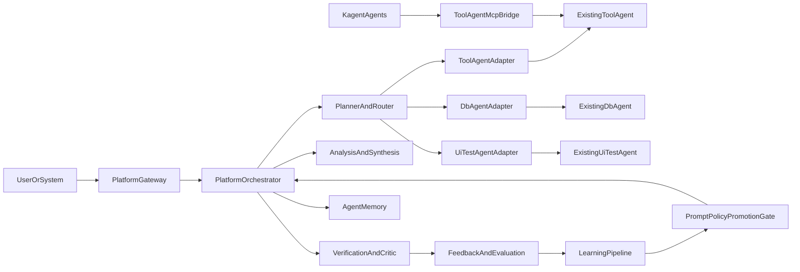

# Agent Platform — Architecture

**Status:** Phase 0 documentation (Markdown only)  
**Scope:** Parallel replacement module. No application code changes in this phase.  
**Related:** [A2A protocol](a2a-protocol.md) · [Execution flow](execution-flow.md) · [Production gates](production-gates.md) · [Module README](../../support-agent/README.md) · [Migration map](../../support-agent/MIGRATION_MAP.md)

## Terminology (locked)

| Term | Meaning |
|------|---------|
| **support-agent** | Canonical name/identity of the orchestration agent (plans, routes, analyzes, verifies, HITL) across tech, product, billing, internal and external issues. Humans remain assignees. |
| **Agent Platform** | The system module that implements `support-agent`: gateway + orchestrator + contracts + adapters + intelligence + memory + learning |
| **Platform Orchestrator** | Temporal worker + planner/router + activities that call specialist agents (runtime of `support-agent`) |
| **Specialist agents** | `tool-agent`, `db-agent`, `ui-test-agent` — independently deployable; **never deleted** by platform decommission |
| **Legacy platform path** | Today’s `gateway/` + `platform_worker/` + shared `libs/` + `catalog/` usage |
| **Replacement module** | Repo folder `support-agent/` (package `am_support_agent`) — built alongside legacy; delete legacy only after prod gates |

Folder and identity are both **`support-agent`** (not `platform-agent`).

## Inventory (current monorepo)

| Component | Path | Port / entry | Role | Status |
|-----------|------|--------------|------|--------|
| Tool Agent | [`tool-agent/`](../../tool-agent/) | `:8141` | Preferred data/tool executor | **Active** |
| DB Agent | [`db-agent/`](../../db-agent/) | `:8140` | Legacy DB/query specialist | **Legacy / compatibility** |
| UI Test Agent | [`ui-test-agent/`](../../ui-test-agent/) | `:8130` | Playwright / visual testing | **Active** |
| Gateway (legacy) | [`gateway/`](../../gateway/) | `:8090` | Temporal client L2 API | **Keep until decommission** |
| Platform worker (legacy) | [`platform_worker/`](../../platform_worker/) | Temporal task queue `agent-platform` | AlertIncident + SPT workflows | **Keep until decommission** |
| Ports SDK | [`libs/platform-ports/`](../../libs/platform-ports/) | package `am_platform_ports` | Protocols + schemas + fakes | Shared seed |
| Adapters | [`libs/platform-adapters/`](../../libs/platform-adapters/) | package `am_platform_adapters` | Postgres RunStore, MinIO, LLM, tickets, … | Shared seed |
| Catalog | [`catalog/`](../../catalog/) | prompts / verify / spt | Prompt + check + SPT data | Shared seed |
| Kagent | [`k8s/kagent/`](../../k8s/kagent/) | MCP bridge `:8085` | Declarative agents → Tool Agent MCP | Integration path |

## System diagram

## Ownership boundaries

| Concern | Owner | Not owned by Agent Platform |
|---------|-------|-----------------------------|
| Grafana dashboards / Alert Ops edge | `am-obs-platform` | Platform may **call** Grafana via Tool Agent tools |
| Cluster Helm / Temporal install | `am-infra` | Platform ships its own deploy charts under `support-agent/deploy/` when built |
| Specialist tool implementations | `tool-agent` / `db-agent` / `ui-test-agent` | Platform only adapters over HTTP/MCP |
| Dashboards content publish | obs-platform compiler | Do not duplicate dashboard YAML here |

## Parallel-run rule

While the replacement is built and proven:

1. **Do not edit** specialist agent code for platform needs (adapters compensate).
2. **Do not delete or modify** legacy `gateway/` / `platform_worker/` as part of building the new module.
3. New module uses **distinct** service names, routes, Temporal task queues, credentials, and data namespaces.
4. Old path remains the **rollback** target until production gates pass.
5. **Deletion** is Phase 5 only, with explicit multi-party approval ([production-gates.md](production-gates.md)).

## Design principles

1. Platform orchestrates; specialists execute.
2. A2A contracts are stable; adapters fill gaps on existing APIs.
3. Tool Agent preferred over DB Agent for overlapping capabilities.
4. Memory is advisory; live tools remain authoritative.
5. Learning is offline + gated; no live self-modification of production agents.
6. Temporal owns durable orchestration and HITL signals.
7. Kagent talks to Tool Agent via MCP; Platform talks via HTTP adapters (two entry paths, one preferred executor).
