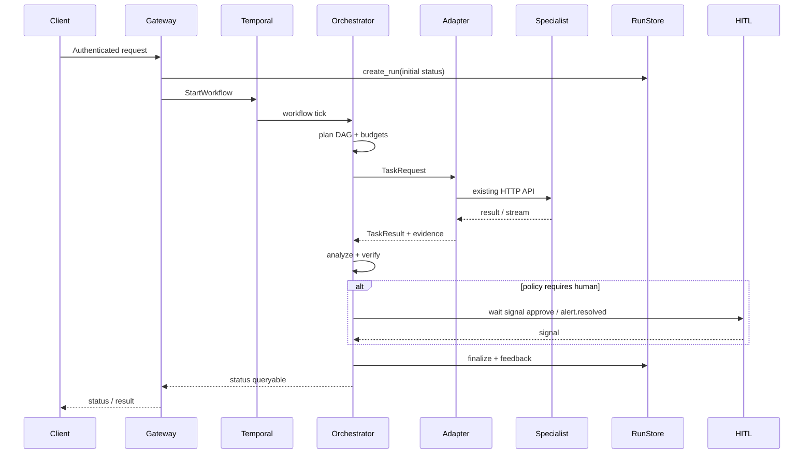

# Platform execution flow

**Status:** Phase 0 documentation  
**Related:** [Agent Platform](agent-platform.md) · [A2A protocol](a2a-protocol.md) · [Production gates](production-gates.md)

## Lifecycle



## Steps (normative)

1. **Authenticate** — Gateway validates Bearer (legacy today: `GATEWAY_API_TOKEN`). Replacement uses service identity + RBAC.
2. **Create durable run** — Postgres RunStore (`agent_runs` / `agent_run_steps`) before heavy work.
3. **Plan DAG** — Planner builds tasks with cost/latency/fan-out budgets.
4. **Route** — Registry + allowlists; Tool preferred over DB; UI only for browser caps.
5. **Execute via adapters** — Call existing Tool / DB / UI HTTP APIs unchanged.
6. **Aggregate evidence** — Provenance on every artifact (`docs_ref`, tool result refs).
7. **Analyze + verify** — LLM via `LlmPort` + catalog verify checks (metrics/logs/health).
8. **HITL** — Temporal signals when policy requires:
   - `approve`
   - `alert.resolved`
   - `alert.refired`
9. **Persist outcome** — Status, cost, latency, feedback events.
10. **Offline learning (later)** — Propose prompt/policy/playbook candidates; **never** auto-promote to production without evaluation + promotion gate.

## Legacy workflows (current path — keep running)

| Workflow | File | Role |
|----------|------|------|
| `AlertIncidentWorkflow` | `platform_worker/.../workflows/alert_incident.py` | Alert → triage → ticket → analyze → infra → verify → HITL |
| `SptRunWorkflow` | `platform_worker/.../workflows/spt_run.py` | SPT catalog fan-out load tests |

Replacement must achieve **parity** with these behaviors before cutover ([production-gates.md](production-gates.md)).

## Memory mapping (no new stores first)

| Memory layer | Existing backing | Notes |
|--------------|------------------|-------|
| Episodic (runs/steps) | Postgres RunStore via `platform-adapters` | Platform ledger |
| Documents / artifacts | MinIO DocStore (+ GDrive failover) | Opaque `docs_ref` |
| Procedural (prompts, checks, SPT) | `catalog/prompts`, `catalog/verify`, `catalog/spt` | Data, not Python logic |
| Semantic (embeddings) | Agent-local Qdrant (tool / db / ui-test) | Not in platform-adapters today; document ownership before adding a platform Qdrant |

## Learning / feedback (gated)

```text
FeedbackEvent → candidate store → offline eval suite → promotion gate → catalog/prompt or policy update
```

Rules:

- No live self-modification of specialist agents.
- No production prompt/policy change without evaluation + human promotion approval.
- Candidates never write into the live catalog without the gate.
