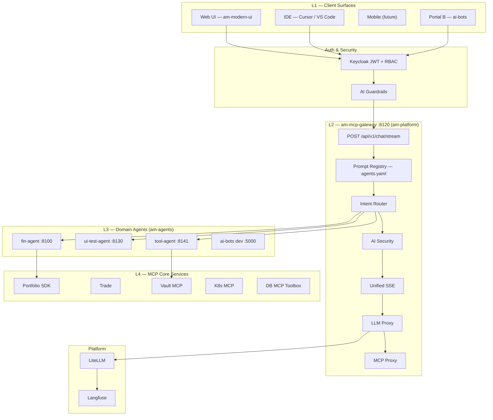
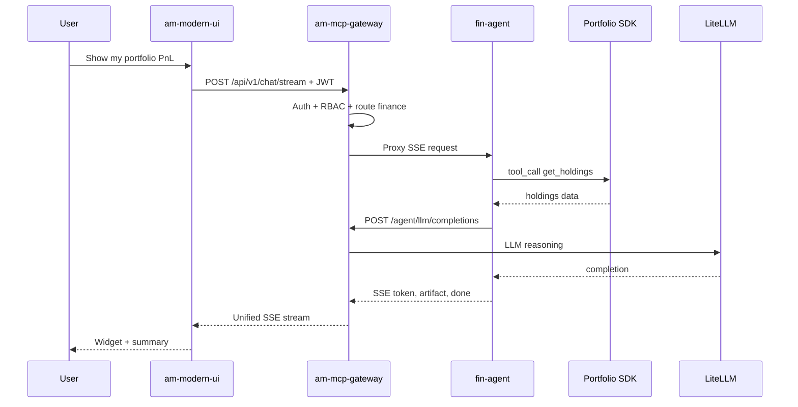

# AI Gateway + MCP Architecture

If the `.drawio` file appears blank in GitHub or your browser, open it locally in Cursor/VS Code with the **Draw.io Integration** extension, or use [app.diagrams.net](https://app.diagrams.net) → **File → Open from → Device**.

Also available inside the working master file: `enterprise-agent-ecosystem.drawio` → page **AI Gateway Architecture**.

Try the compressed variant if needed: `02-ai-gateway-mcp-design-compressed.drawio`

---

## Target architecture (Mermaid)

## Chat request flow

## Whiteboard mapping

| Whiteboard | Implementation |
|---|---|
| AI Gateway | `am-platform/am-mcp-gateway` |
| fin-agent | `am-fin-agent` / `fin-portfolio-agent` |
| MCP server | tool-agent + fin MCP + LiteLLM registry |
| Prompt Registry | `agents.yaml` (planned) |
| LiteLLM / billing | LiteLLM + Langfuse via gateway |
| Modern UI | `am-modern-ui` Flutter ai-chat |
