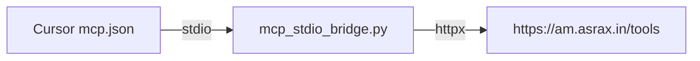

# Connecting to tool-agent

## Recommended: Cursor MCP (stdio bridge → live HTTP)

tool-agent exposes a **REST API**, not a native MCP server. The recommended Cursor setup is a **local stdio MCP bridge** that proxies to the live API.



**Why this approach**

- Works with live preprod today (`https://am.asrax.in/tools`)
- No change to cluster ingress or am-mcp-gateway required
- Separate from in-cluster `MCP_ENABLED` / toolbox (adapters run directly in preprod)

### Setup

1. Install deps (includes `mcp` SDK):

```bash
cd am-agents/tool-agent
pip install -r requirements.txt
```

2. Copy [`mcp.json.example`](../mcp.json.example) into Cursor MCP settings. Update the `args` path to your machine:

```json
{
  "mcpServers": {
    "am-tool-agent-preprod": {
      "command": "python",
      "args": ["a:/InfraCode/AM-Portfolio-grp/am-agents/tool-agent/scripts/mcp_stdio_bridge.py"],
      "env": {
        "TOOL_AGENT_BASE_URL": "https://am.asrax.in/tools",
        "TOOL_AGENT_CALLER": "cursor-mcp"
      }
    }
  }
}
```

3. Restart Cursor MCP. You should see tools:

| MCP tool | Purpose |
|----------|---------|
| `tool_agent_health` | GET `/health` |
| `tool_agent_ready` | GET `/ready` |
| `tool_agent_plan` | POST `/api/v1/tools/plan` |
| `tool_agent_query` | POST `/api/v1/tools/query` |
| `tool_agent_execute` | POST `/api/v1/tools/execute` (pass `intent_json`) |

4. Smoke test without Cursor:

```bash
python scripts/test_mcp_bridge.py
```

### Environment variables

| Variable | Default | Purpose |
|----------|---------|---------|
| `TOOL_AGENT_BASE_URL` | `https://am.asrax.in/tools` | API base (no trailing slash required) |
| `TOOL_AGENT_CALLER` | (empty) | Sets `X-Agent-Caller` header when set |

## HTTP API (Postman / curl)

See [`postman/`](../postman/) or:

```bash
curl -sS https://am.asrax.in/tools/health
curl -sS -X POST https://am.asrax.in/tools/api/v1/tools/plan \
  -H "Content-Type: application/json" \
  -d '{"query":"list mongo databases","backend":"mongodb","read_only":true}'
```

## Not the same as internal toolbox MCP

- **`mcp/pool.py`** in tool-agent is for calling Mongo/Redis toolbox MCP servers when `MCP_ENABLED=true`
- Preprod runs **`MCP_ENABLED=false`** and uses Python **adapters** directly
- Cursor `mcp.json` talks to the **tool-agent HTTP API**, not raw Mongo MCP

## Preprod caveats

- Traefik `strip-prefix-apps` must include `/tools`
- If Python gets Cloudflare 1010, use PowerShell `Invoke-RestMethod` or the stdio bridge (often works)

## Multi-agent HTTP contract

Programmatic agents (orchestrator, fin-agent, k8s-ops, etc.) should call tool-agent **directly over HTTP**, not via the stdio bridge.

### Required headers and body fields

| Field | Required for agents | Purpose |
|-------|---------------------|---------|
| `backend` | Yes when `X-Agent-Caller` is set | Routes parse_rules to the correct plugin (`TOOL_AGENT_REQUIRE_BACKEND_FOR_AGENTS=true` in preprod) |
| `X-Agent-Caller` | Recommended | Audit trail + Langfuse `caller:{name}` tags; enables confidence policy |
| `read_only` | Default `true` on `/query` | Blocks writes unless `/execute` with confirmation |

### Recommended flow

1. **`POST /api/v1/tools/plan`** — parse intent + resolve params without executing. Review `intent`, `confidence_ok`, and `resolved_params`.
2. **`POST /api/v1/tools/execute`** — run structured intent from plan (best for vault writes and exact params).
3. **`POST /api/v1/tools/query`** — one-shot NL for read-only when rules cover the query.

### Confidence policy

When `X-Agent-Caller` is set, `/query` rejects intents below `TOOL_AGENT_INTENT_MIN_CONFIDENCE` (0.55 in preprod helm, 0.75 default in code). Low-confidence rule matches fall through to LLM when `LLM_INTENT_ENABLED=true`.

### In-cluster base URL

```
http://am-tool-agent.am-apps-preprod.svc.cluster.local:8141
```

### Example (agent caller)

```bash
curl -sS -X POST https://am.asrax.in/tools/api/v1/tools/plan \
  -H "Content-Type: application/json" \
  -H "X-Agent-Caller: fin-agent" \
  -d '{"query":"read secret preprod postgress","backend":"vault","read_only":true}'
```

### Query corpus (regression examples)

Canonical NL examples live in [`scripts/query_corpus.yaml`](../scripts/query_corpus.yaml):

```bash
python scripts/run_query_corpus.py --local
python scripts/run_query_corpus.py --preprod --mode plan --agent-caller corpus-test
```

### Backend cheat sheet

| Use case | Backend |
|----------|---------|
| Document portfolios, trades, market data | `mongodb` |
| Relational users, subscriptions, SQL counts | `postgres` |
| Ephemeral session/cache keys | `redis` |
| Event streaming, topic peek/lag | `kafka` |
| Vector collections, bug memory | `qdrant` |
| Logs, metrics, dashboards | `grafana` |
| Infra/service secrets | `vault` |

## kagent UI (SRE ops)

Unified agent **`am-infra-ops`** combines K8s tools + tool-agent MCP.

```bash
kubectl apply -f am-agents/k8s/kagent/tool-agent-mcp-deployment.yaml
kubectl apply -f am-agents/k8s/kagent/remote-mcpserver-tool-agent.yaml
kubectl apply -f am-agents/k8s/kagent/agent-am-infra-ops.yaml
```

Open `https://kagent.munish.org`, select **am-infra-ops**, use **Ctrl+Enter** to send.

See [`docs/MCP_CONTRACT.md`](MCP_CONTRACT.md) for portable MCP tool names.

## IDE MCP (any editor)

Same stdio bridge works in **Cursor, VS Code, Windsurf, Claude Desktop** — set `TOOL_AGENT_CALLER` per IDE (`vscode-mcp`, `windsurf-mcp`, etc.).

## SSE streaming

Stage-by-stage events for `/query`, `/plan`, `/execute`:

```bash
curl -N -X POST http://localhost:8141/api/v1/tools/plan/stream \
  -H "Content-Type: application/json" \
  -d '{"query":"list kafka topics","backend":"kafka","read_only":true}'
```

Event types: `stage`, `intent`, `resolved`, `result`, `token`, `done`, `error`.

Disable via `TOOL_AGENT_STREAMING_ENABLED=false`. MCP bridge uses stream endpoints when `TOOL_AGENT_MCP_USE_STREAM=true`.
